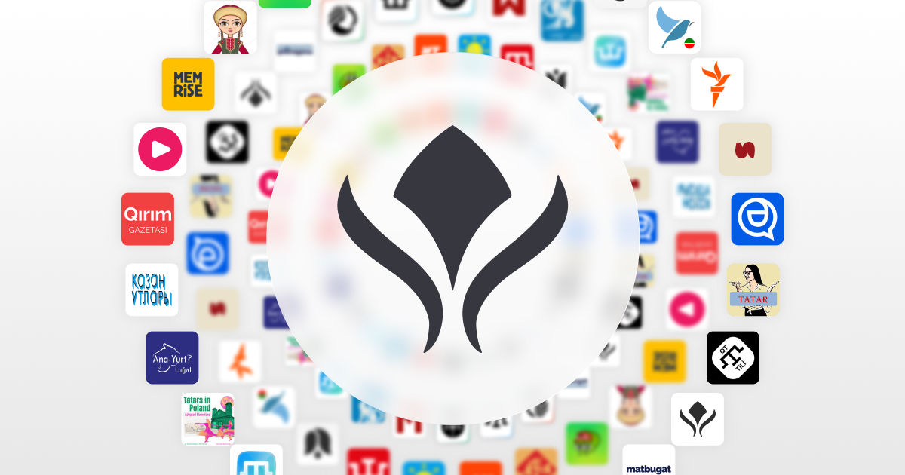
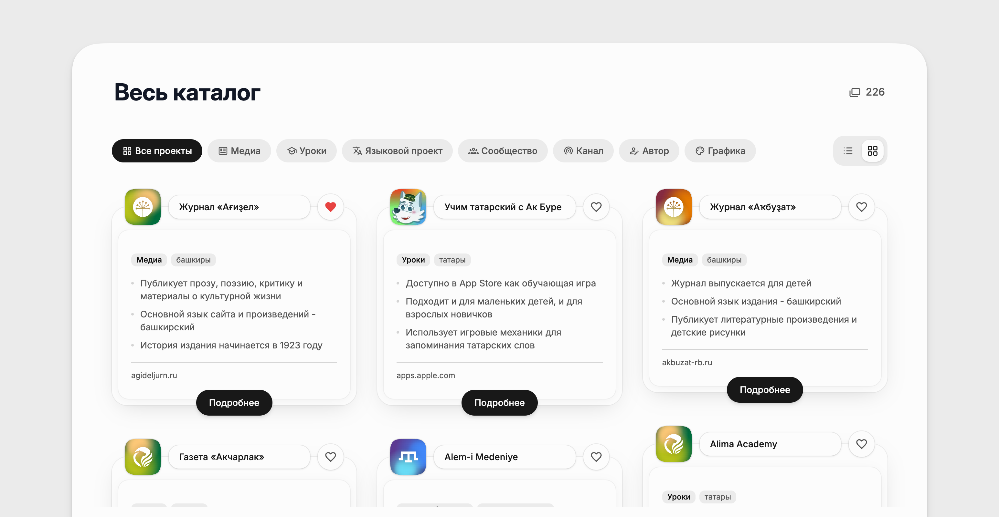
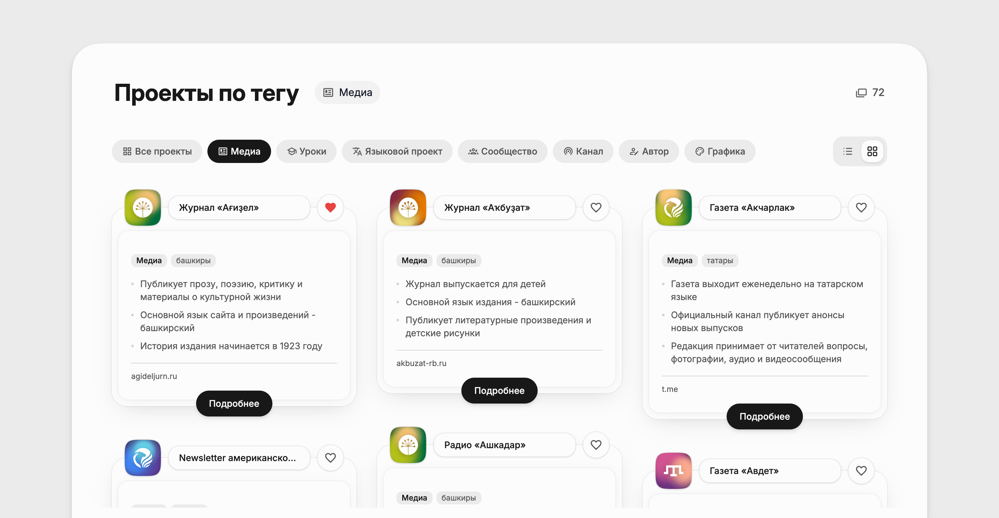

# media.tatarverse

**Каталог проектов, которые ведут татары, башкиры и крымские татары**: авторы,
каналы, медиа, языковые платформы, уроки, графика.

[**media.tatarverse.cc**](https://media.tatarverse.cc) · [Добавить проект](https://media.tatarverse.cc/add) · [Telegram](https://t.me/the_tatarverse)

[](https://astro.build)




Сайт статический: контент лежит в репозитории обычными markdown-файлами, а не в
базе. Каждая карточка - один файл, который можно прочитать, поправить и прислать
пул-реквестом. Сборка проверяет себя сама: неизвестный тег, отсутствующий
перевод или сломанная ссылка на ассет роняют билд, а не уезжают на прод.

## Как это выглядит

| Каталог | Фильтр по категории |
|---|---|
|  |  |

## Содержание

- [Как добавить проект](#как-добавить-проект)
- [Устройство карточки](#устройство-карточки)
- [Локальный запуск](#локальный-запуск)
- [Команды](#команды)
- [Структура репозитория](#структура-репозитория)
- [Как это устроено](#как-это-устроено)
- [Вклад в проект](#вклад-в-проект)
- [Лицензия](#лицензия)

## Как добавить проект

Три пути, от простого к техническому.

**1. Форма.** Заполнить [форму на сайте](https://media.tatarverse.cc/add) -
заявка уходит на модерацию, карточка появляется в каталоге в течение 1-24 часов.
Форма создает GitHub Issue, а бот собирает из нее черновик карточки.

**2. Issue.** Открыть
[issue](https://github.com/proxima812/media.tatarverse.cc/issues/new) с
описанием проекта - если не хочется заполнять форму или нужно что-то обсудить.

**3. Pull request.** Добавить файл карточки самому - самый быстрый путь, если вы
работаете с кодом. Дальше об этом.

## Устройство карточки

Одна карточка - один файл `src/data/cards/<id>.md`. Тела у файла нет, только
фронтматтер:

```markdown
---
name: "15 daqqa"
description: "Авторский Instagram-блог педагога Эмине Шерфе о разговорном крымскотатарском языке и повседневных идиомах."
facts:
  - "Ведет блог с 2019 года, аудитория - в основном крымские татары"
  - "Ранее работала на телеканале ATR и радиопрограммах о языке и истории"
  - "Аккаунт «учим крымскотатарский» - около 13 тысяч подписчиков"
url: "https://www.instagram.com/15_daqqa/"
pubDate: "2026-08-29"
categories: ["author", "lessons"]
tags: ["teacher", "language", "education", "blog", "educational"]
peoples: ["crimean-tatar"]
---
```

Правила, которые проверяет сборка:

- **`id`** - имя файла без расширения, вида `<название>-<категория>`. После
  публикации не меняется: этим же id связаны перевод и логотип.
- **`facts`** - от трех до четырех коротких фактов. Не рекламные обещания, а
  проверяемые утверждения о проекте.
- **`categories`, `tags`, `peoples`** - только значения из реестра
  [`src/components/Catalog/taxonomy.ts`](./src/components/Catalog/taxonomy.ts)
  (`peoples`: `tatar`, `bashkir`, `crimean-tatar`). Новое значение - отдельное
  решение, а не побочный эффект новой карточки.
- **Перевод** - файл с тем же id в `src/data/cards-en/`: только `name`,
  `description` и `facts`. Ссылка, логотип и таксономия от языка не зависят.
  Без перевода падает `bun run check:i18n`.
- **Логотип** - необязателен. Файл `src/assets/images/logo/<id>.png` подключается
  полем `logo`. Нет логотипа - карточка сама рисует мэш-градиент со знаком
  народа, постоянный для этого названия.

Чеклист ревью карточки целиком -
[`.agents/skills/starter-card-review/SKILL.md`](./.agents/skills/starter-card-review/SKILL.md).

## Локальный запуск

Нужен [Bun](https://bun.sh) и Node 22.12 или новее.

```bash
git clone https://github.com/proxima812/media.tatarverse.cc
cd media.tatarverse.cc
bun install
bun dev
```

Сайт поднимется на `http://localhost:4321`. Ключей, `.env` и внешних сервисов
для локальной работы не нужно - весь контент лежит в репозитории.

## Команды

```bash
bun dev             # дев-сервер
bun run build       # сборка в dist/
bun run preview     # локальный просмотр собранного
bun run check       # astro check - типы .astro и .ts
bun run check:seo   # build + проверка каждой страницы в dist/
bun run check:i18n  # у всех карточек есть EN-перевод
bun run verify      # все сразу
```

`bun run check:seo` проверяет каждую собранную страницу: `<title>`, description,
canonical, набор Open Graph, валидность JSON-LD, `<html lang>`, количество `<h1>`,
`noindex` на 404 - и что все локальные ссылки на ассеты действительно существуют
в `dist/`. Ошибки роняют команду, предупреждения только печатаются.

Линтера и форматтера в репозитории нет намеренно (Biome не разбирал `.astro` и
переформатировал SVG в `public/`) - стиль держится ревью и тем, как написан
соседний код.

## Структура репозитория

```
main.config.ts            конфигурация сайта - единственный файл под правку
astro.config.mjs          интеграции, i18n-роутинг, dualmark
src/
  data/cards/             карточки каталога (RU - источник истины)
  data/cards-en/          английские переводы карточек
  data/markdown/          текстовые страницы: о проекте, правовые, «Добавить»
  components/Catalog/     каталог, карточки, фильтры, реестр таксономии
  components/pages/       сборка страниц из компонентов
  components/SEO/         метатеги, JSON-LD, аналитика
  i18n/                   локали, словари, useTranslations/buildAlternates
  integrations/           robots.txt, ai.txt, manifest, IndexNow, markdown-двойники
  pages/                  маршруты (en/ - вторая локаль)
  styles/tailwind.css     тема и семантические токены
docs/adr/                 принятые решения и их причины
CONTEXT.md                глоссарий домена
AGENTS.md                 правила репозитория
```

## Как это устроено

**Стек.** Astro (статическая генерация), Tailwind CSS v4 на семантических
токенах, TypeScript в strict, Bun. UI-фреймворков и клиентских островов нет:
интерактив - фильтры, закладки, поиск по каталогу - это несколько небольших
скриптов на самой странице.

**Конфигурация.** Все, что относится к сайту как таковому - URL, Open Graph,
цвета темы, аналитика, feature flags - лежит в
[`main.config.ts`](./main.config.ts). Значения проверяются на старте `dev` и
`build`: неверный URL, кривой GTM ID, отсутствующая OG-картинка - сборка падает
сразу и перечисляет все проблемы разом.

**Двуязычность.** Нативный i18n Astro, без пакетов. Русская локаль - без
префикса (`/catalog`), английская - `/en/catalog`. Строки интерфейса -
`src/i18n/locales/<locale>.ts`. hreflang и sitemap с alternate-записями
собираются сами. Нет английской карточки - на `/en/` показывается русский текст,
страница не пропадает.

**Поиск и закладки.** Поиск по каталогу - фильтрация уже отрендеренного списка на
месте, без индекса и запросов. Сохраненные проекты живут в `localStorage`
браузера и никуда не отправляются.

**SEO.** Метатеги, Open Graph и JSON-LD на каждой странице, хлебные крошки
уходят в разметку `BreadcrumbList`, `robots.txt` и sitemap генерируются на билде.
Автоматика - в `src/integrations/`.

## Вклад в проект

Приветствуются и карточки, и правки кода, и исправления фактических ошибок в
описаниях - у каждой карточки на сайте есть ссылка «Предложить правку», которая
ведет прямо в редактор нужного файла на GitHub.

Перед пул-реквестом:

1. `bun run verify` - зеленый;
2. правила репозитория - [`AGENTS.md`](./AGENTS.md);
3. доменные слова - [`CONTEXT.md`](./CONTEXT.md) (карточка, а не «запись»);
4. решения, которые уже приняты и почему, - `docs/adr/`.

Карточка описывает живой проект живых людей. Если описание неточное или проект
закрылся - это баг, и о нем стоит сообщить.

## Лицензия

- **Код** - [MIT](./LICENSE).
- **Контент каталога** (тексты карточек в `src/data/`) -
  [CC BY 4.0](https://creativecommons.org/licenses/by/4.0/deed.ru): можно
  использовать и переделывать с указанием источника.
- **Логотипы проектов** в `src/assets/images/logo/` принадлежат их владельцам и
  используются для обозначения самих проектов.
